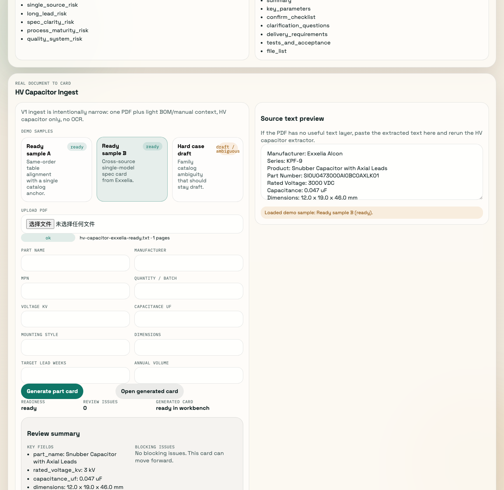
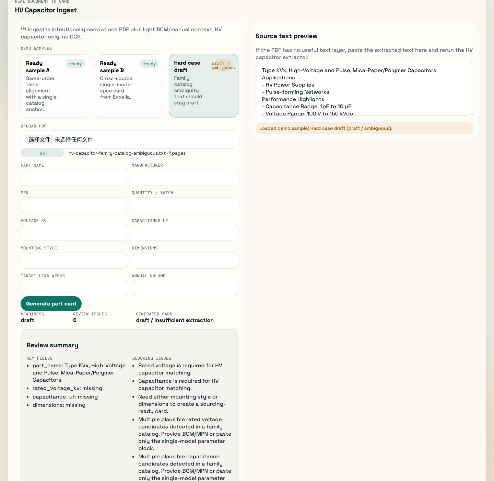

# Fusion Buyer MVP

HV capacitor procurement intelligence workbench for engineering and sourcing teams.

This repo demonstrates a narrow but real MVP wedge: take de-identified `HV Capacitor` text, extract structured sourcing fields, gate readiness, and push the result into a part card, supplier matching, risk scoring, and RFQ workflow.

Current release snapshot:

- Scope: `HV Capacitor` only
- Status: V1 demo-ready
- Evidence: 2 cross-source `ready` single-model samples plus 1 hard-case `draft` family-catalog sample
- Release notes: `RELEASE_NOTES_v0.1.0.md`
- Author: [niwa414](https://github.com/niwa414)

## Interface snapshots

| Ready single-model path | Hard-case ambiguous path |
| --- | --- |
|  |  |
| `Ready sample B` shows cross-source single-model extraction reaching `ready` with usable key fields and no blocking issues. | `Hard case draft` shows family-catalog ambiguity staying `draft` with explicit blocking guidance instead of a guessed card. |

## What this repo includes

- A Vite + React single-page demo for the first MVP wedge.
- A rule-based matching engine for part-to-supplier scoring.
- An ingest path for `HV Capacitor` documents:
  - PDF text extraction
  - field extraction
  - normalization
  - readiness gating
  - conversion into the existing part/risk/RFQ workflow
- Five views aligned to the product spec:
  - Project Board
  - Part Detail
  - Supplier Profiles
  - Risk Board
  - Export Center
- Demo data for:
  - 5 parts
  - 12 supplier profiles
  - generated RFQ and risk outputs

## Why this wedge

This first version chooses pulse power components instead of a broad fusion supply-chain platform. That keeps the MVP narrow enough to:

- prove domain understanding fast
- build a reusable field schema
- create a credible supplier capability library
- generate reports that look useful before deep integrations exist

## Product assumptions in this demo

- Suppliers are fictional demo profiles.
- Matching is deterministic and explainable.
- AI is represented by structured extraction outputs, not model calls.
- Human review is required before any shortlist or RFQ is final.
- No ERP, PLM, quoting workflow, or pricing logic is included.
- V1 ingest supports `HV Capacitor` only.
- OCR is intentionally out of scope for V1.

## V1 milestone status

- V1 is complete enough to ingest `HV Capacitor` text, extract fields, normalize them, gate readiness, and push the result into the current part/risk/RFQ workflow.
- V1 also includes field-level observability, golden validation fixtures, `calibrate:ingest`, expected comparison, and expected template generation for real-sample tuning.
- V1 now has its first `ready` real single-model sample, captured as `hv-capacitor-single-model-anchor.txt`, with these key outputs locked into regression:
  - `part_name = KVX01S104K0T`
  - `rated_voltage_kv = 1`
  - `capacitance_uf = 0.1`
  - `dimensions = 1.81 x 1.47 x 0.17 inches`
  - `readiness = ready`
- V1 now also has a second, different-source `ready` single-model sample, captured as `hv-capacitor-exxelia-ready.txt`, with these key outputs locked into regression:
  - `part_name = Snubber Capacitor with Axial Leads`
  - `rated_voltage_kv = 3`
  - `capacitance_uf = 0.047`
  - `dimensions = 12.0 x 19.0 x 46.0 mm`
  - `readiness = ready`
- The enabling capability for that milestone is narrow by design:
  - single-model anchor detection via `catalog number / part number / MPN`
  - minimal table-like aligned extraction for same-order capacitance and dimensions
- With those two `ready` samples, V1 now has initial cross-source single-model generalization across two different vendor document styles.
- `sample2` is now tracked as a table-heavy hard-case regression: preprocess lifted it from effectively non-extractable to partially extractable, and the current `draft` outcome is acceptable. It should not receive further special-case optimization.
- V1 explicitly does not include a backend, database, OCR, multi-category ingest, a general parser, or any agent-style automation.
- The current recommendation is still not to expand scope.
- `part_name` preferring the explicit part number over a product-family label is now clearly a P2 polish item, not a V1 blocker.
- The next sample should be another different-source `kV-class` single-model text sample so the same extraction path can be pressure-tested again before any scope expansion.

Recommended commands:

```bash
npm run validate:ingest
npm run calibrate:ingest -- /absolute/path/to/sample.txt
npm run calibrate:ingest -- /absolute/path/to/sample.txt --emit-expected-template
```

## Run locally

```bash
npm install
npm run dev
```

Production build:

```bash
npm run build
```

Validate ingest fixtures:

```bash
npm run validate:ingest
```

Inspect field-level ingest calibration:

```bash
npm run calibrate:ingest
```

Inspect a real text sample without touching OCR:

```bash
npm run calibrate:ingest -- /absolute/path/to/sample.txt
```

Emit a lightweight expected template from the current normalized result:

```bash
npm run calibrate:ingest -- /absolute/path/to/sample.txt --emit-expected-template
```

Write the calibration dump to a JSON file:

```bash
npm run calibrate:ingest -- /absolute/path/to/sample.txt --out /absolute/path/to/calibration.json
```

Optional expected sidecar for a real sample:

- put `/absolute/path/to/sample.expected.json` next to `/absolute/path/to/sample.txt`
- `calibrate:ingest` will emit field-level mismatches for any keys present in the expected JSON
- expected JSON may use either normalized property names such as `ratedVoltageKv` or field names such as `rated_voltage_kv`
- calibration output now also includes a compact `summary` block and `lowConfidenceFields` so sample quality is visible before reading the full field rows

## Real sample tuning loop

1. Prepare one de-identified `HV Capacitor` text sample as `/absolute/path/to/sample.txt`. Prefer `.txt` as the calibration input. If the source is a PDF with selectable text, copy it out and save it as `.txt` first. If the PDF is scanned, image-heavy, encrypted, or otherwise not selectable, treat it as unsupported in V1 and do not add OCR work.
   For the next calibration round, prefer a kV-class sample with copyable text, cleaner field labels, and less page-header/page-footer noise.
2. Run `npm run calibrate:ingest -- /absolute/path/to/sample.txt` to inspect summary, missing fields, conflicts, and low-confidence fields.
3. Run `npm run calibrate:ingest -- /absolute/path/to/sample.txt --emit-expected-template` and copy the lightweight template into `/absolute/path/to/sample.expected.json`.
4. Edit `/absolute/path/to/sample.expected.json` by hand to confirm the fields you actually trust.
5. Run `npm run calibrate:ingest -- /absolute/path/to/sample.txt` again and use `mismatchFields` plus `fieldComparisons` to tune the extractor.

## Demo flow

Recommended live demo order:

1. `hv-capacitor-single-model-anchor.txt`
   Show the first `ready` path: a single catalog anchor plus table-like alignment can produce a sourcing-ready card.
2. `hv-capacitor-exxelia-ready.txt`
   Show the second `ready` path: the same V1 extractor now generalizes across a different vendor and a cleaner single-model spec style.
3. `hv-capacitor-family-catalog-ambiguous.txt`
   Show the hard-case `draft` path: the system keeps family-catalog ambiguity visible instead of forcing a false single-value card.

The current demo is intentionally narrow. It demonstrates ingest, review, readiness gating, and the existing part/risk/RFQ workflow. It does not try to show a backend, a real supplier master, or live enterprise integration.

## Demo checklist / talk track

Demo before-check:

- Run `npm run validate:ingest`
- Run `npm run build`
- Start locally with `npm run dev`
- In the UI, open the `HV Capacitor Ingest` panel and use the 3 demo sample buttons at the top

Recommended demo sequence:

1. `Ready sample A`
2. `Ready sample B`
3. `Hard case draft`

Suggested value points:

- `Ready sample A`: a single-model sample with table-like extraction can still become `ready`
- `Ready sample B`: the same V1 path can generalize across a different vendor source and still become `ready`
- `Hard case draft`: a family catalog stays `draft`, surfaces ambiguity, and gives actionable guidance instead of guessing

During the demo, keep attention on:

- `Readiness`
- `Blocking issues`
- `Key fields`
- `Review summary`

One-line positioning:

- Single-model samples can enter `ready`
- Multi-model or ambiguous samples stay `draft` and do not get guessed into a false card
- This demo is focused on ingest, review, readiness, and the current workbench, not on a backend or a live supplier master

## Key files

- `src/domain/types.ts`: core part, supplier, match, risk, and RFQ types
- `src/domain/schema.ts`: field blueprint for the chosen wedge
- `src/domain/data.ts`: demo part and supplier library
- `src/domain/engine.ts`: rule-based supplier scoring and risk logic
- `src/domain/export.ts`: report generation
- `src/App.tsx`: five-page workbench UI
- `src/ingest/types.ts`: ingest data contracts
- `src/ingest/hv-capacitor-rules.ts`: HV capacitor alias tables, regex fragments, unit patterns, and keyword maps
- `src/ingest/pdf.ts`: PDF text extraction and status classification
- `src/ingest/extract-hv-capacitor.ts`: HV capacitor-only field extraction
- `src/ingest/normalize-hv-capacitor.ts`: normalization and readiness gating
- `src/ingest/observability.ts`: field calibration rows, required-field checks, and review summary
- `src/ingest/to-part-record.ts`: mapping into the current domain engine
- `src/ingest/golden/*.json`: normalized golden outputs for ingest regression
- `scripts/validate-ingest.ts`: minimal regression script
- `scripts/calibrate-ingest.ts`: field-by-field calibration dump

## Recommended next step

Run calibration on a third, different-source de-identified `HV Capacitor` single-model sample and do not add more feature scope until that cross-source check is complete.
